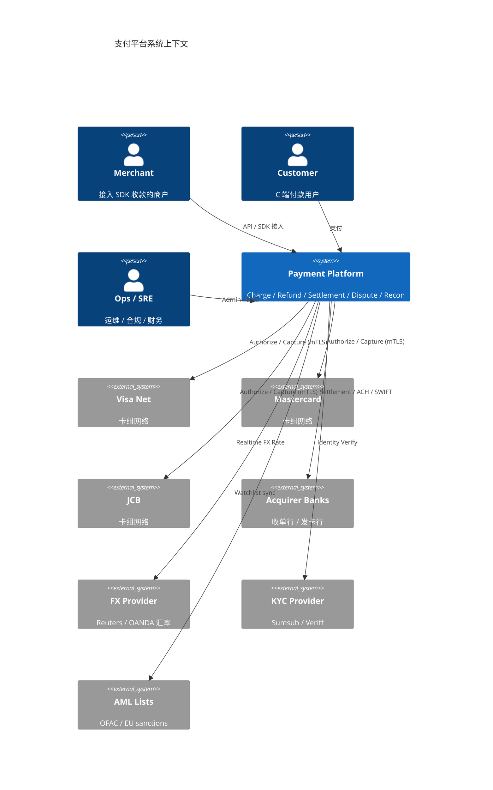
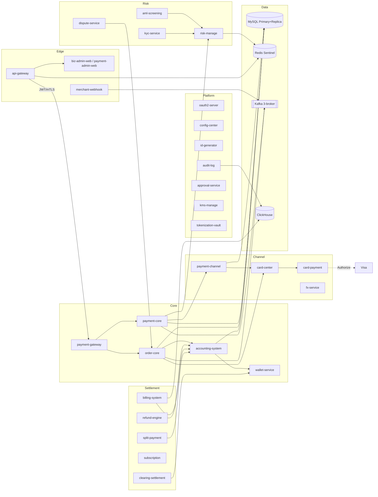
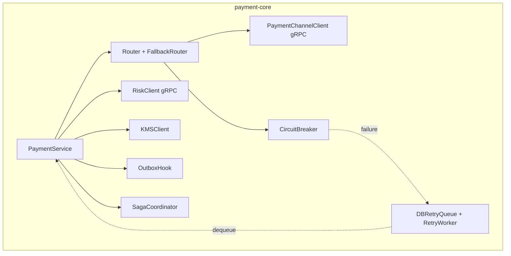

# C4 Architecture Diagram — Payment Platform

C1-3 视角的 Mermaid 图。生产可用 PlantUML / Structurizr 重画;Mermaid 足够 README 嵌入。

## C1 — System Context

## C2 — Containers (Microservice 视角,38 个 packages)

## C3 — Component (payment-core 内部)

## 关键不变量 (across the system)

1. **资金安全**: 所有 ledger 写都走 outbox + double-entry; 日切前必平 (trial-balance cron)
2. **幂等**: 每个 mutating endpoint 都接 Idempotency-Key,UNIQUE 索引兜底
3. **PCI scope 收敛**: PAN 只流过 card-center + card-payment 两个进程,其它服务一律拿 token
4. **mTLS**: 所有跨服务 gRPC 都强制 mTLS (除 dev/staging insecure flag);CN 白名单严格
5. **可观测**: 所有 entrypoint 注入 trace_id; payment-core / accounting-system 10% sampling, error 100%
