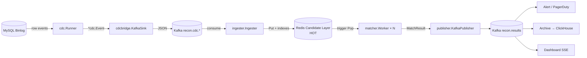

# Recon Pipeline — Architecture

## 一图概览



## 为什么这样设计

| 旧架构 (CDC → Redis 直写) | 新架构 (CDC → Kafka → Consumer → 候选层) |
|---|---|
| 紧耦合:Redis 抖动 → binlog 读取卡死 | Kafka 缓冲解耦,Redis 抖动消费侧降速,binlog 不阻塞 |
| 单进程瓶颈 | Consumer group 水平扩展;按 partition 切并发 |
| 重算难:数据已经在 Redis,要回放只能重读 binlog | Kafka offset 重置即可回放任意时间窗 |
| 没有死信处理:坏消息阻塞队列 | DLQ topic 隔离,运维独立排查 |
| 规则跑在主路径上 | Matcher 拉模式 (Pop trigger),完全 stateless |

## 各层职责

### 1) cdc.Runner (沿用)

读 MySQL binlog,产 `cdc.Event` (含 service / table / pk / op / Indexes 等)。

### 2) cdcbridge.KafkaSink (新)

接到 cdc.Runner 后,序列化 Event → 推 Kafka topic `recon.cdc.<service>`。

- **Partition key**: 按 `pi_id / order_id / merchant_id / idempotency_key` 优先级选,
  保证同一业务实体顺序稳定 (单分区有序保证)。
- **Topic**: 一服务一 topic,便于 ingester 按服务拆分 / fan-out。
- **At-least-once**: kgo `AllISRAcks` + retry 5;消费侧用 (svc:table:pk) 去重。

### 3) ingester.Ingester (新)

Kafka consumer group → 反序列化 → `candidate.Layer.Put`。

- **Consumer group**: `reconplatform-ingester`,多 pod 同 group 自动 rebalance。
- **At-least-once**: 写候选层成功才 commit offset;失败不 commit,下次重试。
- **DLQ**: 解析失败的消息 → `recon.dlq` topic,加 `X-Recon-Failure` header。

### 4) candidate.Layer (新, Redis HOT 层)

按业务关联键 (biz_key) 把待匹配事件暂存,等齐 N 方触发匹配。

- **Bucket**: `recon:cand:<biz_key>:<value>` 是 Redis HASH,放该 biz_key 关联的全部事件。
- **TTL**: 默认 24h,可按 biz_key 调 (pi_id 24h / idempotency 48h)。
- **Trigger**: HSET 后桶大小 ≥ N → push trigger 到 `recon:cand:trigger` LIST。
- **Sweep**: 每分钟扫一遍,把 age > maxAge 的 bucket 强制推 trigger (兜底超时)。
- **Lock**: `recon:cand:lock:<trigger>` SET NX EX,防多 worker 并发处理同桶。

### 5) matcher.Worker (新, 无状态)

Pop trigger → Lock → Get 桶里全部事件 → 跑全部 Rule → Publish 结果 → AckMatch。

- **Stateless**: 同一 input 必出同一 output,可水平扩展。
- **Rule**: 内置 `CrossServicePresenceRule` / `AmountEqualityRule` (Go),
  + 已有 Starlark 引擎适配 (用 starlark 包封一层 Rule 接口即可)。
- **Verdict 五种**: matched / mismatched / orphan / pending / error。
- **Pending 保留桶**: 等其他方;其他终态 Ack 清桶。

### 6) publisher.KafkaPublisher (新)

MatchResult → `recon.results` topic。

- **Partition key**: TriggerKey;同实体结果按时间稳定排序。
- **Headers**: `verdict / rule / trigger / worker / ts` 都打 header,
  下游订阅者按 header 过滤,不必反序列化 body。

### 7) 下游消费 (示例)

- **Alerting**: 订阅 `recon.results`,header `verdict in {mismatched, error}` → PagerDuty。
- **Archive**: 直入 ClickHouse 冷库 (`recon_results` 表,5y 保留)。
- **Dashboard**: SSE 把最近 N 条流到 admin web 实时面板。

## 部署

三角色独立部署,各自水平扩展:

```bash
# CDC bridge: 跟 binlog 读取部署在一起 (一般每个 MySQL shard 一份 pod)
RECON_ROLE=cdc-bridge ./recon-pipeline

# Ingester: kafka consumer group, 起 N 副本看吞吐
RECON_ROLE=ingester \
  RECON_KAFKA_TOPICS=recon.cdc.order-core,recon.cdc.payment-channel \
  ./recon-pipeline

# Matcher: 起 M 副本 × workerCount worker
RECON_ROLE=matcher RECON_WORKER_COUNT=8 ./recon-pipeline
```

dev 单机 `RECON_ROLE=all`。

## 容量规划

- **CDC 吞吐**: 限 MySQL binlog,典型 10K events/s per shard。
- **Kafka**: 32 partition / topic,3 broker RF=3 (见 ha-data chart) 足够 50K events/s。
- **Candidate Layer**: 单 Redis 实例 50K HSET/s;100K 候选桶不到 1GB 内存。
- **Matcher**: 每个 trigger 评估 < 10ms (Go 规则) / < 100ms (Starlark 重规则)。
  4 worker × 8 pod = 32 并发,扛 3K trigger/s。

## 故障矩阵

| 故障 | 影响 | 兜底 |
|---|---|---|
| Kafka broker 全挂 | binlog → Redis 直连失效, 但 cdc 仍读 binlog 缓存到 disk WAL | 恢复后 replay 已读位点 |
| Redis 候选层挂 | ingester 写入失败,offset 不 commit | 恢复后从未 commit offset 处重读 |
| 单个 matcher worker 挂 | 该 worker 持锁的 trigger 等 1m TTL 释放 → 别的 worker 接 | (自动) |
| 规则 panic | safeMatch 兜底,出 VerdictError 给 ops | 上 alert,ops 介入修规则 |
| 跨服务有方迟到 (超 TTL) | sweep 兜底触发 → 出 VerdictOrphan 报警 | 业务侧追 binlog gap |
