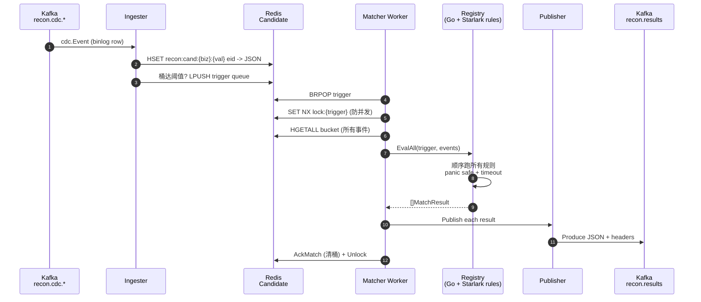

# Stateless Matching Engine — 工作原理

## 名词

| 词 | 含义 |
|---|---|
| **trigger** | 一对 `(biz_key, value)`,例 `(pi_id, pi_abc123)`。候选层桶满 N 条时入触发队列。 |
| **rule** | 一段匹配逻辑。输入 = 桶里全部事件;输出 = `MatchResult{verdict, detail}`。 |
| **verdict** | matched / mismatched / orphan / pending / error |
| **stateless** | 每次 Match 都把所需事件一并喂进来;规则函数本身无内部状态,可水平扩展。 |

## 一次匹配的完整生命周期



## 为什么是 "stateless"

**核心特性:**
> 同一个 `(trigger, events)` 输入,跑 N 次得到 N 个**结构上完全相同**的 MatchResult(时间戳/worker_id 除外)。

**意味着:**

1. **水平扩展无瓶颈**。N 个 matcher worker 各自从 Redis 拉 trigger,谁拉到谁处理,无 sticky session。
2. **失败可重试**。worker 崩了,lock TTL 后(1min)trigger 仍在队列,另一个 worker 接手,结果一致。
3. **可重放**。从 Kafka offset reset 重读所有 cdc 事件,候选层重新填充,匹配结果重新产出,可用于事故复盘。
4. **可并行验证**。同样的 input 喂给"灰度新版本规则"与"线上旧版本规则"并行跑,对比结果,无副作用。

**为达成 stateless 的设计约束:**

- 规则函数 **必须** 是 input → output 的纯计算,不读外部状态(不查别的 Redis key、不调下游 RPC、不写文件)。
- 需要的"上下文"全部走 `events` 切片传入(候选层 Get 一次性把桶里东西全拉出来)。
- 时间相关判断用 `MatchedAt` 字段,**不**直接 `time.Now()`(便于回放时固定时间)。
- 副作用(发邮件 / 写 ClickHouse)统统下沉到 `recon.results` 下游订阅者,规则本身不做。

## Match() 函数的接口契约

```go
type Rule interface {
    Name() string
    Match(ctx context.Context,
          t candidate.TriggerKey,
          events []*store.Event) (MatchResult, error)
}
```

- `t.BizKey` 告诉规则这次触发的业务键(规则可只关心自己感兴趣的 biz_key,其他返 `VerdictPending`)。
- `events` 是该业务键当前桶里全部事件(可能跨 N 个服务的 N 张表)。
- `MatchResult.Verdict` 必填;`Detail` 可选放 want/got/extras。
- panic 由框架(`safeMatch`)兜底,转 `VerdictError`,不影响其它规则。

## 内置规则示例(Go,编译期)

| 规则 | 干什么 |
|---|---|
| `CrossServicePresenceRule` | 配 `ExpectedServices=[A,B,C]`,桶里少任意一方 → `Orphan` / `Pending` |
| `AmountEqualityRule` | 配 `Pairs=[(A.t1,amount),(B.t2,amount)]`,各方 amount 都相等 → `Matched`,不等 → `Mismatched` |

写新 Go 规则只需实现 `Rule` 接口 + `MustRegister`,见 `cmd/recon-pipeline/main.go`。

## 动态编译(Starlark 规则)

> Go 规则要重启进程才能更新。生产里每改一次规则就 rollout 30+ 副本,慢且风险高。
> **动态编译 = 规则源码热替换,不重启进程。**

### 编译模型

```mermaid
flowchart LR
    SRC[.star source]
    CC{script.Engine<br/>Compile}
    CS[*CompiledScript<br/>(字节码缓存)]
    SR[StarlarkRule<br/>(实现 Rule 接口)]
    DR[DynamicRegistry]

    SRC --> CC
    CC -->|"成功"| CS
    CC -->|"失败"| ERR[(❌ 返 error<br/>旧规则保留)]
    CS --> SR
    SR --> DR
```

- 编译**只发生一次**(在 `Compile` / `Replace` 被调用时),产物是 `*script.CompiledScript`(starlark.net 的 AST + program)。
- 后续 `Match()` 调用走 `engine.Run(compiled, ctx)`,是**字节码级别的执行**,不重新解析源码。
- 性能基线:一条 `duplicate_charge` 规则在 100 events 桶上跑 ~ 0.5-2ms(同等 Go 规则 ~ 0.1ms)。

### 热替换(原子 swap)

```go
dynReg := matcher.NewDynamicRegistry(script.NewEngine(5_000_000))

// 首次注册
dynReg.Compile("duplicate_charge", srcV1, "idempotency_key")

// 改源码后热替换(失败不影响 V1)
if err := dynReg.Replace("duplicate_charge", srcV2, "idempotency_key"); err != nil {
    log.Warn("compile failed, V1 still active", "err", err)
    return
}
// 此后所有 EvalAll 用 V2;V1 被替换的 Rule 对象保留在已被 EvalAll 拿走的临时
// 切片里,等那次评估完自然 GC
```

**原子保证:**

1. 编译先于 swap:新源码编译失败 → 旧规则保持。
2. swap 在 Registry 写锁内完成:`Worker.EvalAll` 在拿规则切片时持读锁,一旦拿到就放锁,然后执行;新替换的指针不会影响这个进行中的评估。
3. 多次 Replace 并发:互相串行(写锁互斥),最终态由最后一次 Replace 决定。

### admin web 联动(已有路径)

```
PUT /api/v1/scripts/{id}
  body: { code: "<.star source>", biz_key: "pi_id" }
  →  dynReg.Replace(id, body.code, body.biz_key)
  →  200 / 4xx (返编译错给前端 Monaco 上 underline)
```

`internal/api/editor_html.go` 已经有保存按钮 + Monaco 高亮;只需把 PUT handler 接到 `dynReg.Replace()`。

## 真正的 "原生编译" 进阶选项(可选)

`script.Engine` 用 starlark.net 跑字节码,~ 5–10x 慢于 Go 原生。如果某条规则极热(每秒上万 trigger 评估),三条路:

1. **Go 内建规则**:把高频规则用 Go 实现,通过 `Registry.Register`(无热更新但快)。
2. **WASM 编译**:把 .star 编译成 wasm,用 `wazero` 跑。比 starlark 快 3–5x,仍可热替换。
3. **Go plugin (.so)**:用 `go build -buildmode=plugin` 把规则编译成 .so,运行时 `plugin.Open` 加载。最快但限制多(crossarch / 内存碎片 / glibc 绑定),生产不推荐。

当前实现选 (1)+(Starlark 字节码),覆盖 99% 场景。WASM 路径在 `script.Engine` 加 `Compiler` 抽象就能并入,留作未来扩展。

## 调试 / 可观测

| 项 | 路径 |
|---|---|
| 单条 trigger 评估耗时 | `MatchResult.DurationMS`(随结果发到 result topic) |
| worker 计数(matched/mismatched/orphan/pending/error) | `Worker.Stats()` → /metrics |
| 跳过的锁(并发处理同一 trigger) | `Worker.Stats().SkippedLocks` |
| 编译失败明细 | `DynamicRegistry.Compile/Replace` 返 error → admin web 前端展示 |
| Starlark print() | 走 `script.Logger`,可挂到 zap → 结构化日志查 trace_id |

## 端到端示例

`make test-rule NAME=duplicate_charge FIXTURE=edge` 走的就是这套引擎(本地用 `MemoryLayer` + `FixtureSearcher`)。生产路径只换成 Redis + Kafka,代码完全一致。
